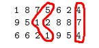

# Assignment 5

Gradescope IDs: 605 & 557

All group members have read and followed the guidelines for academic conduct in
CPSC 320. As part of those rules, when collaborating with anyone outside my
group, (1) I and my collaborators took no record but names (and Gradescope
information) away, and (2) after a suitable break, my group created the
assignment I am submitting without help from anyone other than the course staff.

## 1. Ruler of My Non-Domain

### 1.1 Do Be So Naive

#### 1.1.1
```
naive(n):
	return naiveHelper(n, 1)

naiveHelper(i, j):
	if i = 1:
		return 1
	else:
		return naiveHelper(i-1, j+1) + naiveHelper(i-1, j)
```
#### 1.1.2
Assuming that storing one value of A takes constant space and that the matrix
is not copied on each recursive call, a slightly less naive memoized version of
this algorithm would take _&Theta;(n<sup>2</sup>)_ space as we would store
_1 + 2 + ... + (n - 1) + n = n(n + 1)/2_ computed entries. In other words, the
algorithm fills in all entries above (and including) the anti-diagonal of an _n x n_
matrix, as shown below for n=4:

<table>
<tr>
    <td>1</td>
	<td>1</td>
	<td>1</td>
	<td>1</td>
</tr>
<tr>
    <td>2</td>
	<td>2</td>
	<td>2</td>
	<td>x</td>
</tr>
<tr>
	<td>4</td>
	<td>4</td>
	<td>x</td>
	<td>x</td>
</tr>
<tr>
	<td>8</td>
	<td>x</td>
	<td>x</td>
	<td>x</td>
</table>

As _&Theta;(n<sup>2</sup>)_ entries are computed in constant time each, and the
set-up work would take no greater than _O(n<sup>2</sup>)_ time, the
slightly less naive algorithm would run in _&Theta;(n<sup>2</sup>)_ time.

#### 1.1.3
```
for i = 1 to n:
	for j = 1 to n - i + 1:
		compute A[i,j]
```

### 1.2 Take a Memo!

As a specified solution index is not requested, we return the whole solution
array.
```
memoized(C):
	A = array of length length(C)
	initialize each entry of A to null
	memoizedHelper(A, C, length(C))
	return A

memoizedHelper(A, C, i):
	if A[i] is null:
		if IsPow2(i):
			A[i] = 1
		else:
			min = infinity

			for j = ceil(i / 2) to i - 1:
				candidate = memoizedHelper(A, C, j) + C[i] - C[j]
				if contender < min:
					min = candidate

			A[i] = min
	return A[i]
```

### 1.3 Be a Dynamo!

```
dynamo(C):
	n = length(C)
	mid = floor(n/2)
	A = array of length n

	if n <= 9:
		return 1

	for i = 1 up to 4:
		A[i] = 1

	for i = n down to n - 4:
		A[i] = 1

	for i = 5 up to mid - 1:
		A[i] = min(C[i-1] + A[i-1], C[i-2] + A[i-2])

	for i = n down to mid + 1:
		A[i] = min(C[i+1] + A[i+1], C[i+2] + A[i+2])

	A[mid] = min(C[i-1] + A[i-1], C[i+1] + A[i+1])
	return A[mid]
```

## 2. Parking in Wonderland

### 2.1 Permission Accomplished

#### 2.1.1

_C(n) = C(n - d<sub>t</sub>) + p<sub>t</sub>_

#### 2.1.2

for _n <= 0_, _C(n) = 0_

#### 2.1.3

Assuming that for all d<sub>t</sub> in D, d<sub>t</sub> >= 1, and that every
p<sub>t</sub> in P is positive. Using 1-based indexing and a memoized solution.

```
D = global array of durations, size k
P = global array of prices, size k
A = global array of yet unknown length, uninitialized

findIdealPermits(n):
	A = empty array of size n
	initialize all entries in A to null
	return permitHelper(n)

permitHelper(i):
	if i <= 0:
		return 0

	else if A[i] is null:
		min = infinity

		for t in 1 to k:
			candidate = permitHelper(i - D[t]) + P[t]
			if candidate < min:
				min = candidate

		A[i] = min
	return A[i]
```

### 2.2 Where Did We Park?

```
explainPermit(A):
	i = length(A)
	permits = list of maximum size i

	while A[i] != 0:
		min = infinity
		permitChosen = -1

		for t in 1 to k:
			candidate = A[i] - P[t]
			if candidate < min:
				min = candidate
				permitChosen = t

		if permitChosen = -1:
			throw Error			// should not occur

		i -= D[permitChosen]
		add permitChosen to the beginning of permits

	return permits		
```

## 3. Pwner of All I Survey

### 3.1 A Profound Dis-Likert for Greedy

Let us have question lengths 4,5,3,5,2,6 with m = 6

- **Greedy Solution:** {{4,5,3}, {5,2}, {6}}, score = (12-12)<sup>2</sup> + (12-7)<sup>2</sup>
= 0<sup>2</sup> + 5<sup>2</sup> = 25
- **Optimal Solution:** {{4,5}, {3,5,2}, {6}}, score = (12 - 9)<sup>2</sup> + (12-10)<sup>2</sup>
= 3<sup>2</sup> + 2<sup>2</sup> = 9 + 4 = 13


### 3.2 A Fair and Balanced Survey

*here we want to try every page length we can, recursing the rest of the questions*
e.g.: 1,2,3,4,5 with m = 5
try {{1}, recurse}, {{1,2}, recurse}, {{1,2,3}, recurse}, {{1,2,3,4}, recurse}

our function LowestScore computes the lowest score possible given a list of questions (lengths), Q, and the max length
of a question, m
        LowestScore(Q, m)
            // Form a page in all the different lengths possible with elements off of Q, recurse, get min

            init total, index and to 0
            init score to infinity
            while(total < 2m)
                if(Q[index] != null)
                    total += Q[index]
                    score = min(score, LowestScore(Q[index+1:end], m))
                    index++
                else
                    // if Q[index] == null then we ran out of pages,
                    // we just formed the last page, which scores 0
                    return 0
            // end while

            return score

## 4 Seam Carving

### 4.1 Seamingly Simple
1. 
    - 4+7+4 = 15
    - 5+1+1 = 7

2. C(1,j) = A[1][j]

### 4.2 Seamy Details

C(i,j) = min(C(i,j-1), C(i,j), C(i,j+1)) + A[i][j]
